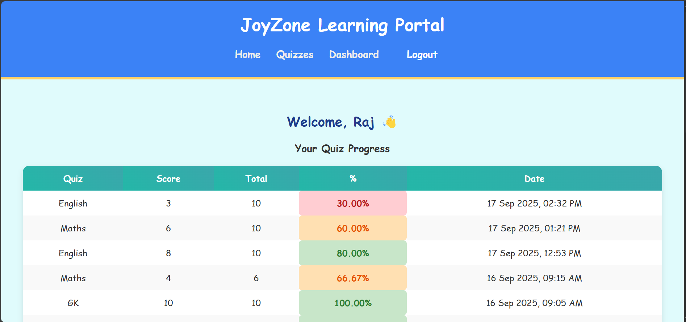
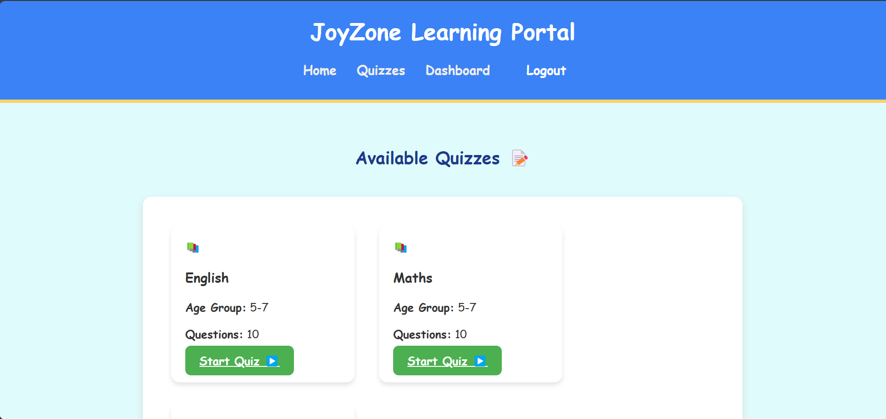

# 🎉 JoyZone – Kids Learning & Fun Portal  

An interactive **Django-based portal** designed for kids to **learn and play quizzes** in a colorful and safe environment.  
Built with ❤️ for learning Django, full-stack development, and creative UI design.  

---

## 🚀 Features  

- 👦 **Two types of login** – Admin & Kid-friendly interface  
- 📚 **Quizzes & Activities** – Fun and engaging  
- 📊 **Dashboard** – Track progress and results with tables & cards  
- 🎨 **Kid-friendly UI** – Playful colors and cards 
- 🔐 **Authentication** – Secure login system  
- 📱 **Responsive Design** – Works on desktop & mobile  

---

## 🛠️ Tech Stack  

- **Backend**: [Django](https://www.djangoproject.com/) (Python)  
- **Frontend**: HTML, CSS, JavaScript  
- **Database**: SQLite (default, easy setup)  
- **Styling**: Custom CSS + Tailwind (optional, for specific pages)  

---

## 📸 Screenshots  

Example:  

  
  
  

---

## ⚙️ Installation & Setup  

Follow these steps to run the project locally 👇  

### 1. Clone the repo  
```bash
git clone https://github.com/your-username/JoyZone_Django_Project.git
cd JoyZone_Django_Project
